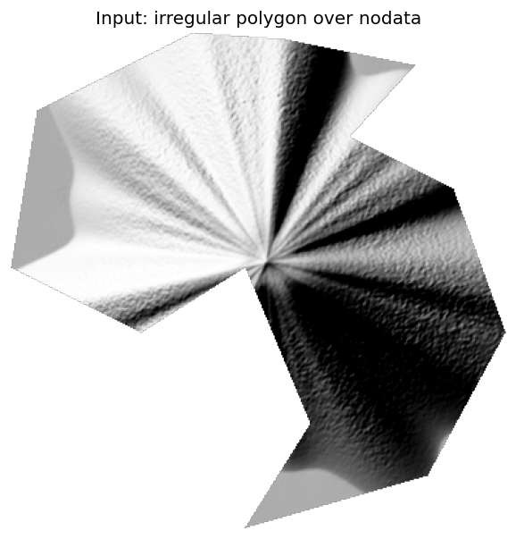
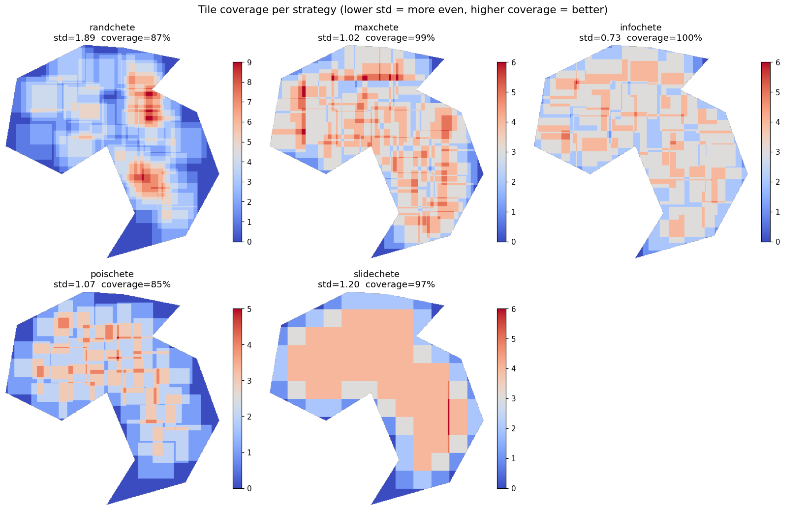
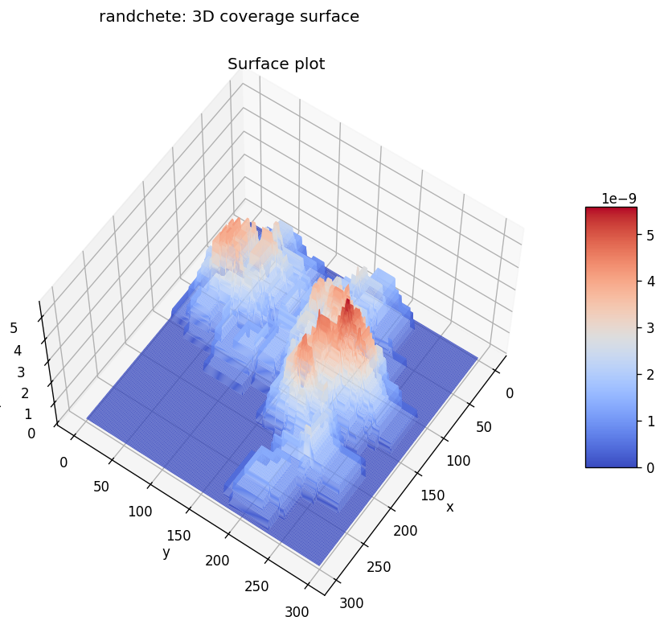
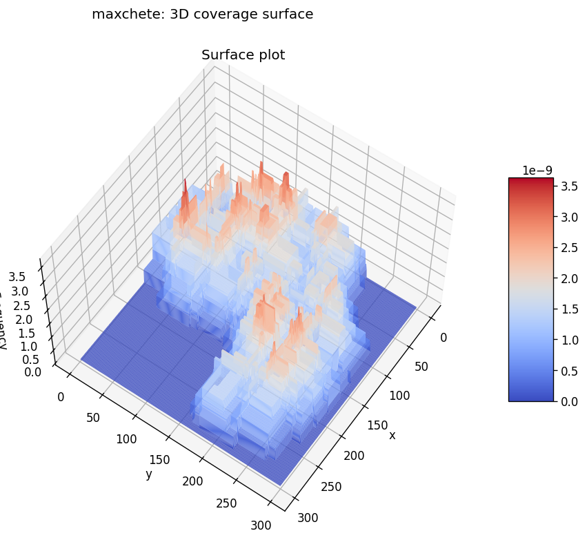
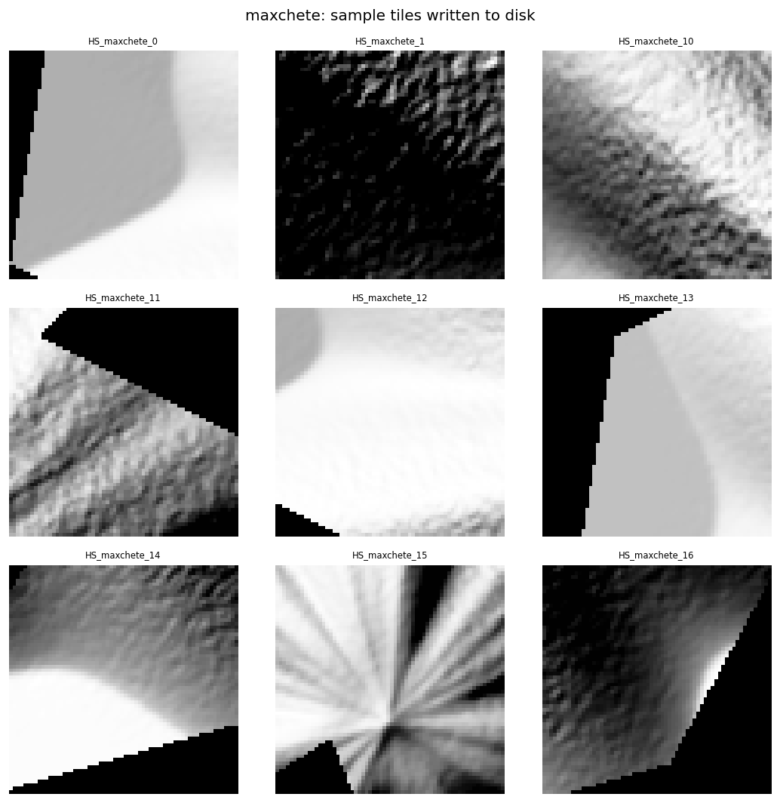

<p align="center">
  
</p>

<h3 align="center">Cut your geospatial data into smaller pieces</h3>

---

**mapchete** crops large geospatial rasters (GeoTIFFs, hillshades, ...) into small tiles for deep learning. It spreads the tiles to cover the data evenly — avoiding both the redundant hotspots of random cropping and tiles that are mostly `nodata`.

## Installation

```bash
git clone https://github.com/abetatos/mapchete.git
cd mapchete
pip install .
```

Requires Python ≥ 3.9. `rasterio` is only lower-bounded (`>=1.3`) for flexibility.

## Quickstart

```python
from mapchete import Tiler

tiler = Tiler.from_name("HS.tif", "maxchete")
tiler.plot_bands()                       # inspect the input

tiler.get_rasters(
    avg_density=4,          # avg. number of tiles covering each input pixel
    size=512,               # output tile side, in pixels
    no_data_percentage=0.3, # discard tiles with more nodata than this
    output_path="raster_clip",
    clear_output_path=True,
)

fig, ax = tiler.get_3Ddistribution()     # study the tile distribution
```

Each tile is written as a GeoTIFF, plus a pickle of its source `rasterio` window.

## Sampling strategies

The strategy is the only thing that changes between algorithms; everything else (loading, nodata trimming, validation, saving) is shared.

| Strategy | Approach |
| --- | --- |
| **maxchete** | Probabilistic max-coverage: steers tiles towards low-density zones for an even spread. |
| **infochete** | Content-aware: more tiles where the image is informative (texture/edges), fewer in flat areas. |
| **poischete** | Blue-noise (Poisson-disk): a minimum spacing between tiles for an even, cluster-free layout. |
| **slidechete** | Deterministic sliding window with a user-defined `overlap` — classic, reproducible tiling. |
| **randchete** | Uniformly random windows (baseline). |

Pick one by name, or build it explicitly to pass parameters:

```python
from mapchete import Tiler, SlidingWindow, PoissonDisk

Tiler.from_name("HS.tif", "infochete")
Tiler("HS.tif", SlidingWindow(overlap=0.5))
Tiler("HS.tif", PoissonDisk(min_dist=400))
```

## See it in action

The repo ships a runnable demo that synthesizes a **mountainous hillshade clipped to an irregular polygon** (valid data surrounded by `nodata` — exactly what mapchete targets) and runs every strategy on it:

```bash
uv run python examples/demo.py     # writes the images below to examples/output/
```

**Input** — a hillshade with ridges and striations over a `nodata` background:

<p align="center">
  
</p>

**Tile coverage per strategy** — each heatmap counts how many tiles cover each pixel:

<p align="center">
  
</p>

Metrics over the valid footprint for one run (lower **std** = more even, higher **coverage** = fewer gaps):

| Strategy | Tiles | Coverage | Std (evenness) |
| --- | --- | --- | --- |
| infochete | 65 | 100% | **0.73** |
| maxchete | 69 | 99% | 0.93 |
| poischete | 37 | 93% | 0.95 |
| slidechete | 63 | 97% | 1.20 |
| randchete | 68 | 91% | 2.31 |

Random cropping (`randchete`) piles tiles into hotspots (high std) while still leaving gaps; the smart strategies spread them evenly across the whole footprint.

### 3D coverage surface

`get_3Ddistribution()` makes the difference obvious. Random sampling builds sharp spikes (some areas over-sampled, others bare), while `maxchete` produces a smooth, even plateau:

<p align="center">
  
  
</p>

### Sample tiles

The generated tiles. Edge tiles are kept only when their `nodata` fraction stays within `no_data_percentage`:

<p align="center">
  
</p>

## Merging tiles back

`merge_tiffs` stitches the generated tiles back into a single mosaic — handy to visually check the coverage:

```python
from mapchete import merge_tiffs
merge_tiffs(folder="raster_clip")
```

## Development

The project uses [uv](https://docs.astral.sh/uv/) for environment management:

```bash
uv sync --extra test
uv run pytest
```
